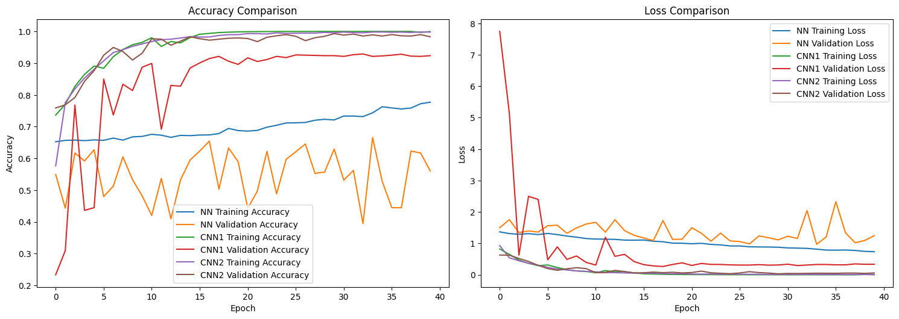

# Brain Tumor Classification Analysis NN vs. CNN

## Overview
- Investigation Comparing the Results of a Traditional Neural Network vs. a Convolutional Neural Network in Image Classification Tasks. Following that, a second CNN was built, improving on the first one. Achieved 99.3% Validation Score.
- Brain Tumor MRI Dataset by Masoud Nickparvar: [[Dataset](https://www.kaggle.com/datasets/masoudnickparvar/brain-tumor-mri-dataset)]

## Key Findings
- Validation Accuracy: 99.3 % vs. 94.4% vs. 67.8%
- Model Architecture: Traditional NN, Custom CNN (inspired by VGG), Improved Custom CNN
- Classes: Glioma, Meningioma, No Tumor, Pituitary

## Techniques Used
- Data Preprocessing and Augmentation
- Convolutional Layers
- Dense Layers
- Max Pooling
- Dropout
- Batch Normalisation
- ReLU and Softmax Activation Functions
- Learning Rate Scheduling
- Early Stopping
- Categorical Cross-Entropy Function
- Adam Optimiser

## Libraries and Frameworks
- TensorFlow/Keras
- Scikit-learn
- NumPy
- Matplotlib & Seaborn
- Pandas

## Visualizations
- Training/Validation Curves
- Sample Classifications
- Confusion Matrix
- Sample Activation Steps

## Discussion
The first two models clearly showed the strengths of a convolutional layer in image processing tasks. To improve the first CNN model, heavier regularisation was implemented, stronger data augmentations was used, and the model was simplified to address the overfitting. Larger pooling was used and less convolutional layers and filters were used. This improved model trained much faster (a fraction of the trainable parameters) and was less prone to overfitting, achieving a very good score on the test set.

The investigation clearly showed the power of CNNs when it comes to image processing. The CNN massively outperforms the NN in terms of accuracy, precision, recall and F1-scores across all 4 classes. The final CNN model achieved near perfect results with the validation set. For the NN, it had some higher values for the recall for 'notumor' and 'pituitary' which indicates that those are easier to identify. The NN model struggles to identify all the actual positive cases, despite having a high precision. The lower recall values show that the model is precise but misses many true cases. The CNN models have good balance in precision and recall, as shown by the high F1-scores.

## Setup
1. Clone repository
2. Install requirements
3. Run Jupyter Notebook

## CNN Sample
Performance

Sample Predictions by the 2nd CNN Model

Sample Activation Steps

